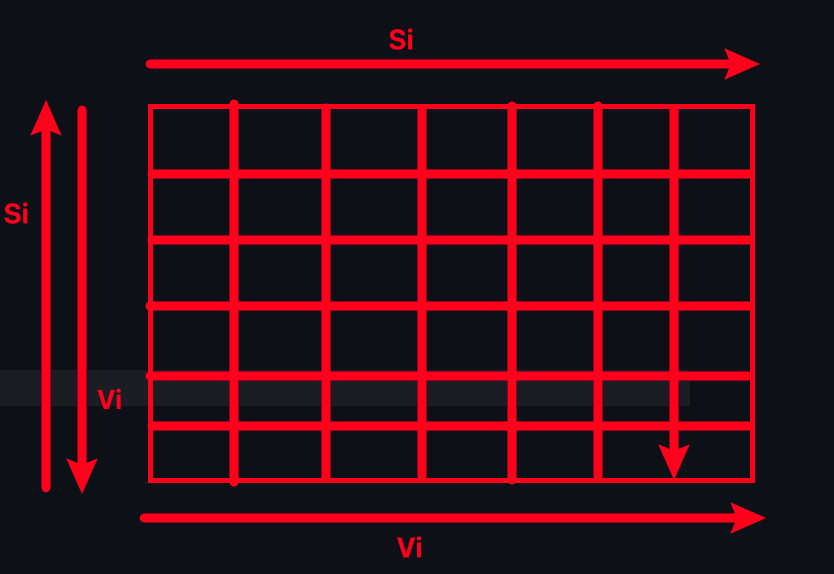

# 题目
给你一个整数数组 nums ，找到其中最长严格递增子序列的长度。

**子序列**: 是由数组派生而来的序列，删除（或不删除）数组中的元素而不改变其余元素的顺序。例如，[3,6,2,7] 是数组 [0,3,1,6,2,2,7] 的子序列。

方法1:
    使用dp

方法2:
    使用耐心排序。

## 证明
### 定义：
a[N]: 长度为N的序列。
Si：序列性，i1< i2< < ... < in。
Vi：值序列性，a[i1]< a[i2]< ... < a[in]

设递增子序列为n，牌堆数为c。

找子序列其实就是在原始的序列中选择若干个数字，保证其序列性。

因为在列方向上Si和Vi冲突，则只能选择一个数字。所以n <= c。

第k列的所有数字不可能全部大于第k+1列，因此： 存在 n = c。

所以最长递增子序列为c。